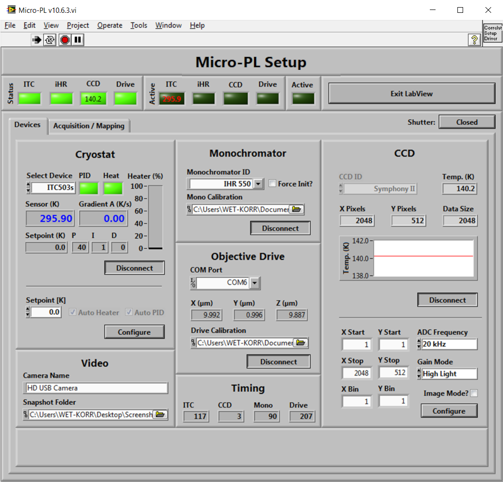
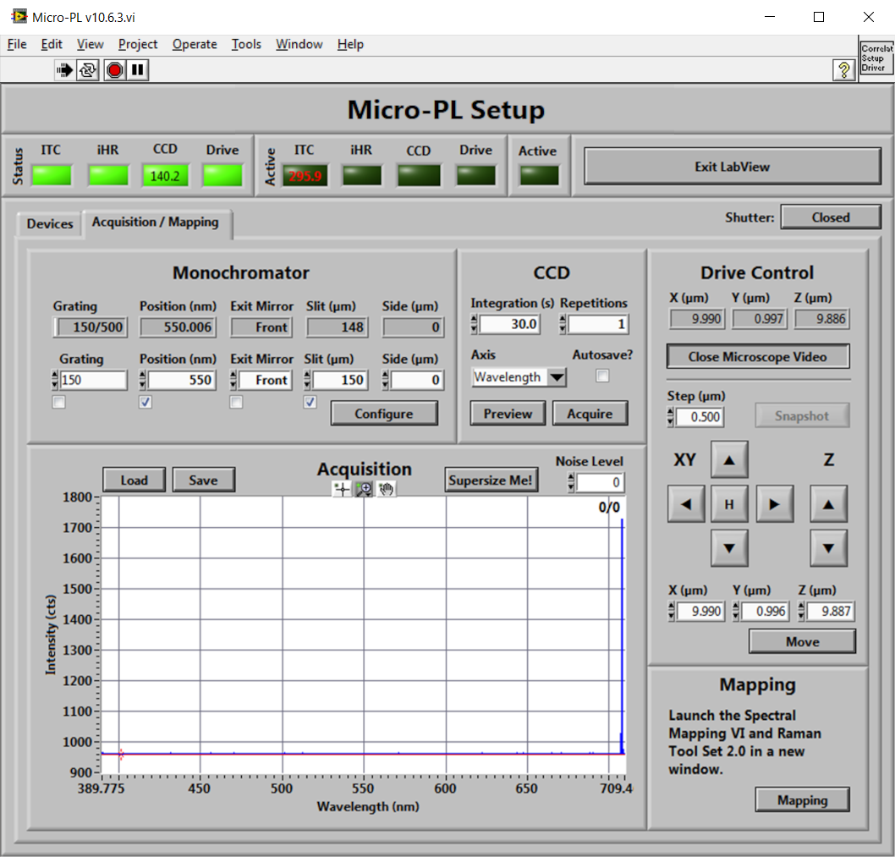
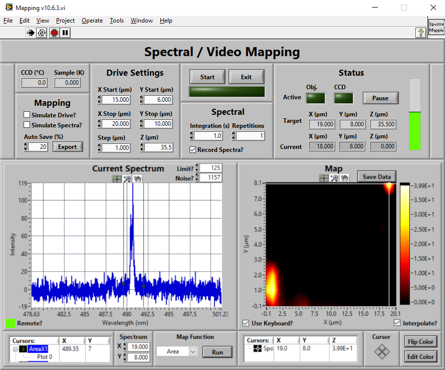

.. role:: underline
    :class: underline

.. cssclass:: title

   |front-title|

.. cssclass:: title-sub

   |front-subtitle|

**Last Update:** 11.03.2022 (v10.6.3)

This is a LabView 2010 project for controlling a custom-built Micro-Photoluminescence setup.

It provides convenient access to all integrated device settings, manual and live acquisition of spectral data and integrates a tool for automated luminescence or image mapping.

.. contents::
   :depth: 2

.. raw:: pdf

    PageBreak docsPage

Requirements
============

The current release offers control over the following devices:

* Oxford ITC503 Temperature Controller
* Newport NPC3SG Piezo Drive Controller (open-loop only)
* Horiba iHR 550 Monochromator
* Horiba Symphony II CCD

Some devices are no longer used but are still functional in older versions of the programs:

* Horiba CCD-3000/3500 (< 10.5.0)
* Newport ESA-C Actuator Controller (< 10.6.0)

The required LabVIEW device drivers are not included in the `vi` section of the project, but are embedded in the built releases.

If you need to modify or extend the programm, please download the drivers from the manufacturers' websites.

Further, this package includes functionality from the `Video Toolset <https://github.com/sfadschm/Video-Toolset>`_ and the `Raman Live Tool Set <https://github.com/sfadschm/Raman-Live-Tool-Set>`_.

.. raw:: pdf

   PageBreak

Interface
=========

This section gives an overview about all available controls and indicators.

Devices
-------

   Frontend of the *Devices* tab of the Micro-PL driver (v10.6.3).

The devices tab is used to (dis-)connect all devices integrated in the setup and displays their status.

Further, device settings can be adjusted for the *Temperature Controller* and the *CCD Camera*.

.. list-table::
   :widths: 25 75
   :header-rows: 1

   * - **Section**
     - **Description**

   * - :literal:`\  Cryostat \ `
     - Connects to the temperature controller of the cryostat.

       When connected, displays the current temperature and gradient and the controller settings.

       The :literal:`\  Setpoint \ ` control can be used to set the target temperature for the integrated heater.

   * - :literal:`\  Monochromator \ `
     - Connects to the spektrometer.

       Hardware initialization can be disabled in case it was already done with the :literal:`\  Force Init? \ ` checkbox before reconnecting.

       A calibration file can be loaded into the :literal:`\  Mono Calibration \ ` control to provide fitting parameters for linearization of the grating positions.

   * - :literal:`\  CCD \ `
     - Connects to the detector.

       When connected, displays the current sensor temperature (and history) and hardware information.

       All available device settings can be adjusted and employed by the :literal:`\  Configure \ ` control.

       Note that the :literal:`\  Image Mode? \ ` switch will automatically change the :literal:`\  ADC Frequency \ ` to avoid slow image rendering.

   * - :literal:`\  Objective Drive \ `
     - Connects to the piezo actuator controller.

       A calibration file containing the voltage-position characteristics of the actuators can be loaded into the :literal:`\  Drive Calibration \ ` control to provide accurate movement.

   * - :literal:`\  Video \ `
     - Defines the default :literal:`\  Camera Name \ ` (as visible in the *Device Manager*) to connect to when running the *Video Toolset*.

       The :literal:`\  Snapshot Folder \ ` defines the directory where all snapshots from the *Video Toolset* will be stored.

   * - :literal:`\  Timing \ `
     - Displays the read-out time of the connected devices during the last status poll. This can be used to track down frozen or lagging device connections, e.g., from GPIB issues.

.. raw:: pdf

   PageBreak

Acquisition / Mapping
---------------------

   Frontend of the *Acquisition / Mapping* tab of the Micro-PL driver (v10.6.3).

The acquisition and mapping tab is used to prepare and conduct measurements and to start the automated mapping tool.

It provides control over the *piezo drive*, the  *monochromator* and the integration settings of the *CCD camera*.

.. list-table::
   :widths: 25 75
   :header-rows: 1

   * - **Section**
     - **Description**

   * - :literal:`\  Monochromator \ `
     - Monitors (top row) and controls (bottom row) the monochromator settings.

       Changed settings will only be deployed to the device if the corresponding :literal:`\  checkbox \ ` control below the setting is ticked.

   * - :literal:`\  CCD \ `
     - Controls the acquisition parameters of the detector and the display options of the spectrum.

       :literal:`\  Repetitions \ ` will be averaged by the software, the build-up of the final spectrum is displayed at each integration step.

       If :literal:`\  Autosave? \ ` is activated, all recorded spectra will automatically be saved to the directory selected in the pop-up dialog.

       The :literal:`\  Acquire \ ` button will trigger a single acquisition of the detector, while :literal:`\  Preview \ ` initiates continuous acquisition.
       Note that the :literal:`\  Repetitions \ ` setting is ignored in *Preview* mode.

       The x-axis of the graph display in the :literal:`\  Acquisition \ ` section can be adjusted by the :literal:`\  Axis \ ` control.
       Note that the *Energy* scale requires the subtraction of the static CCD background noise before it can be applied as a *Jacobian Transformation* of the data is performed in the background.

   * - :literal:`\  Acquisition \ `
     - Displays the current spectrum.

       The :literal:`\  Load \ ` and :literal:`\  Save \ ` controls can be used to replace or export the currently displayed spectrum from/to a tab-seperated text file.
       Note that the :literal:`\  Save \ ` control will always export raw data.

       The :literal:`\  Noise Level \ ` control can be used to subtract a constant background value from the spectral data before being displayed. This control **must** be set before switching the x-axis to *Energy*.

       Use the :literal:`\  Supersize Me! \ ` button in *Preview* mode (e.g., during adjustment) to open the live spectrum in a full-screen window for better visibility.

   * - :literal:`\  Drive Control \ `
     - Displays (top) and controls the piezo actuator controller.

       The :literal:`\  Open/Close Microscope Video \ ` button will invoke an instance of the *Video Toolset* for calibration and adjustment.

       If the *Video Toolset* is running, the :literal:`\  Snapshot \ ` control can be used to save a frame capture to the folder defined in the `Devices <#devices>`_ tab.

       The actuators can be moved with a pre-defined :literal:`\  Step \ ` size using the arrow controls or can be send to a fixed position using the :literal:`\  X \ `, :literal:`\  Y \ `, :literal:`\  Z \ ` settings with the :literal:`\  Move \ ` button.

   * - :literal:`\  Mapping \ `
     - The :literal:`\  Mapping \ ` button invokes an instance of the automated `luminescence mapping script <#mapping>`_.

.. raw:: pdf

   PageBreak

Mapping
-------

   Frontend of the automated *Mapping* tool of the Micro-PL driver (v10.6.3).

The  mapping tool provides logic to run automated *snake*-shaped sample mapping via a spectral detector or an optical microscope.

For displaying spectral data, the tool integrates the `Raman Live Tool Set <https://github.com/sfadschm/Raman-Live-Tool-Set>`_.

Microscope images can be collected with the `Video Toolset <https://github.com/sfadschm/Video-Toolset>`_.

.. list-table::
   :widths: 35 65
   :header-rows: 1

   * - **Section**
     - **Description**

   * - General
     - The top left panel displays the current :literal:`\  CCD \ ` and :literal:`\  Sample \ ` temperature.

       These data are collected in the :literal:`\  Micro-PL \ ` VI and shared via global variables.

       The :literal:`\  Start \ ` button in the center panel can be used to start and abort a mapping run.

       The :literal:`\  Exit \ ` button should be used to properly close the mapping VI when mapping is done. Please do not use the **X** to close the window.

       Note that changes to, e.g., the *monochromator* or *CCD* settings in the :literal:`\  Micro-PL \ ` VI will be mirrored to the mapping tool even when it is still running.

       The green led will indicate the mapping process to be running by blinking. It also displays a rough estimate of the remaining time to complete the current map.

       After the current map is finished the tool will prompt you to select a file to save the data to.

       If you abort the dialog, you can always also store the current map with the :literal:`\  Export \ ` button.

   * - :literal:`\  Mapping \ `
     - Defines the general conditions for the mapping acquisition.

       **Simulating Devices**

       Ticking the :literal:`\  Simulate Drive? \ ` checkbox will result in the piezo actuators to not move during mapping. Instead, the *XY* coordinates will be calculated pecisely from the :literal:`\  Drive Settings \ `.

       This can, e.g., be useful to run a pseudo-timetrace at a certain sample spot (however, note that the :literal:`\  Preview \ ` mode of the main VI can achieve the same goal much easier).

       The :literal:`\  Simulate Spectra? \ ` mode will generate a pseudo-random constant spectrum at each point of the map instead of collecting data from the detector.

       If activated, the :literal:`\  Integration \ ` and :literal:`\  Repetition \ ` settings of the detector will be ignored.

       Each of these controls will automatically be checked upon invokation of the mapping tool if the corresponding device is not connected in the parent VI to avoid communication errors.

       **Auto-Saving**

       To avoid memory issues during large mapping runs, the current state of the map will periodically be saved to the hard drive.

       By default, auto-saving will be executed each 20 % of the map and will be stored in the *Screenshot* folder.

       You can define the interval with the :literal:`\  Auto Save \ ` control. A value of *0* will disable auto-saving.

       If the *Screenshot* folder is not found, the tool will prompt you to define a target folder upon the first save.

   * - :literal:`\  Drive Settings \ `
     - Defines the spatial dimensions of the mapping run.

       Make sure to use sensible precision for all values.

       *Reverse* mapping is currently not supported.

       The :literal:`\  Z \ ` position of the objective drives is mirrored from the main VI during invokation and will be fixed throughout the map.

   * - :literal:`\  Spectral \ `
     - See the :literal:`\  CCD \ ` section of the main VI's *Acquistion / Mapping* tab.

       If the :literal:`\  Record Spectra? \ ` switch is unchecked, the tool will default to using the *Video Toolset* to conduct a mapping run with the optical microscope instead.

       Note that the  :literal:`\  Integration \ ` and :literal:`\  Repetition \ ` settings of the detector will be ignored in that case.

   * - :literal:`\  Status \ `
     - Displays the progress of the current mapping run.

       The :literal:`\  Active \ ` LEDs indicate which device is currently busy.

       The :literal:`\  Target \ ` and :literal:`\  Current \ ` indicators monitor the desired and actual actuator positions.

       A vertical progress bar is positioned on the right side.

       You can use the :literal:`\  Pause / Resume \ ` button to halt or resume the mapping run after the next step, e.g., to take a closer look at an older datapoint in the map.

   * - :literal:`\  Raman Live Tool Set \ `
     - Displays the current spectrum and the live state of the map.

       The map will be build-up pixel-by-pixel from bottom to top.

       Please refer to the `User Guide <https://github.com/sfadschm/Raman-Live-Tool-Set/wiki/User-Guide>`_ of the Raman *Live* Tool Set for a description of its functionality and interface.

.. raw:: pdf

   PageBreak

Device Calibration
==================

The package includes two tools for calibrating the movement of piezo actuators and monitoring the spatial stability of the sample.

Both tools record snapshot sequences from a video device connected to the computer via the *Video Toolset*. Therefore, a digital microscope should be focussed on a calibration sample, which should consist of repetetive geometric patterns (ideally circles) with known dimensions and distances.

The image sequences can subsequentially be evaluated in suitable image processing software. Good and fast results can, e.g., be achieved using the `ImageJ <https://imagej.net/software/fiji/>`_ `TrackMate <https://imagej.net/plugins/trackmate/>`_ plugin.

Spatial Stability
-----------------

The :literal:`\  Micro-PL Stability Test \ ` tool allows monitoring the stability of the sample setup by recording snapshots in configurable time intervals for a defined period of time.

Piezo Actuators
---------------

The :literal:`\  Micro-PL Drive Calibration \ ` tool can be used for calibrating electro-strictive and piezo actuators in open-loop operation. It ramps the controller voltage in the selected range with a configurable step size and records a snapshot at each point of the ramp.

Calibration has to be conducted seperately for each axis. By defining an inverse voltage range, calibration of the backwards movement direction of the actuator is also possible.

After evaluation, the voltage-position curve should be stored in a simple tab-separated *ini* file in the `Data` directory of the drive controller sub-VI and can then be used as calibration data for positioning the actuators with the main or mapping programs.

.. ######################### Definitions ######################### ..

.. sectnum::
    :depth: 3

.. header::

   .. rst-class:: headertable

   .. list-table::
      :width: 100%
      :header-rows: 0

      * - .. rst-class:: headerbody-sup

          |title-sup|

          .. rst-class:: headerbody

          |title|

.. footer::

   .. rst-class:: footertable

   .. list-table::
      :width: 100%
      :widths: 80 20
      :header-rows: 0

      * - .. rst-class:: footerbody-left

          |copy| 2021-2022 Alexander Schmitz-Wunderlich, University of Duisburg-Essen

        - .. rst-class:: footerbody-right

          ###Page### of ###Total###

.. |front-title|     replace:: Micro-PL
.. |front-subtitle|  replace:: User Guide

.. |title-sup|  replace:: Using
.. |title|      replace:: Micro-PL 

.. |copy|   unicode:: U+000A9 .. COPYRIGHT SIGN